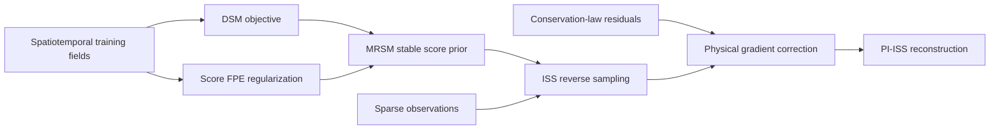

# MRSM: Physics-Informed Generative Solver for Spatiotemporal Field Reconstruction

[](https://arxiv.org/abs/2605.22338)
[](LICENSE)

Official research code for **"Physics-Informed Generative Solver: Bridging
Data-Driven Priors and Conservation Laws for Stable Spatiotemporal Field
Reconstruction."**

> This repository is being prepared for full public reproduction. The core
> model, training code, sampling utilities, and example notebook sources are
> included. Items that are not yet packaged or documented are marked
> **Coming soon** below.

## Overview

Reconstructing continuous physical fields from sparse measurements is
ill-posed, and purely data-driven generative models may produce states that
violate the governing dynamics. This work separates stable prior learning from
inference-time physical enforcement:

- **Martingale-Regularized Score Matching (MRSM)** combines denoising score
  matching with a Score Fokker-Planck Equation regularizer to learn a
  dynamically stable generative prior.
- **Implicit Score Sampling (ISS)** provides an efficient inference scheme for
  variance-exploding stochastic differential equations.
- **Physics-Informed ISS (PI-ISS)** injects gradients of physical residuals
  during sampling, guiding generated states toward the intersection of the
  learned data distribution and the physically admissible manifold without
  retraining the prior.

The framework is evaluated on sparse and multimodal reconstruction problems
involving acoustic pressure and particle velocity fields, Kolmogorov flow, and
ERA5 meteorological fields.

## Method at a Glance



MRSM regularizes the prior during training, whereas PI-ISS applies
task-specific physical constraints only during inference. This separation
allows the same learned prior to support different sparse observation patterns
and physical guidance settings.

## Release Status

| Component | Status |
| --- | --- |
| Spatiotemporal score model and VE-SDE utilities | Available |
| Base score-model training entry point (`train.py`) | Available |
| Score-FPE training source (`train_FT.py`) | Included; validated initialization workflow coming soon |
| Acoustic free-field sampling notebook | Source included; path cleanup and baseline assets coming soon |
| Kolmogorov-flow sampling notebook | Source included; test data and baseline assets coming soon |
| ERA5 sampling notebook | Source included; data and checkpoint coming soon |
| Acoustic free-field data and checkpoint bundle | Available on Zenodo |
| Kolmogorov checkpoint bundles | Available on Zenodo |
| Fully pinned and tested environment file | Coming soon |
| ERA5 data and pretrained checkpoint | Coming soon |
| Kolmogorov training/test data | Coming soon |
| FNO and LNO baseline checkpoints | Coming soon |
| Checkpoint format and DataParallel conversion guide | Coming soon |
| End-to-end commands reproducing every paper figure | Coming soon |
| Additional experimental acoustic datasets and scripts | Coming soon |

## Repository Structure

```text
MRSM/
|-- configs/
|   `-- config.py               # Training and sampling arguments
|-- models/                     # Spatiotemporal score model and baselines
|-- sampler/                    # SDE, ISS, and physics-guided sampling utilities
|-- trainer/                    # Datasets, losses, inverse operators, checkpoints
|-- train.py                    # Base score-model training
|-- train_FT.py                 # Score-FPE fine-tuning research script
|-- 2d_free_field_sample.ipynb  # Sparse acoustic-field reconstruction
|-- kol_sample.ipynb            # Kolmogorov-flow reconstruction
`-- era5_sample.ipynb           # ERA5 reconstruction
```

## Installation

Clone the repository:

```bash
git clone https://github.com/BrianZhu1999/MRSM.git
cd MRSM
```

A fully pinned environment specification is **Coming soon**. For preliminary
code inspection and notebook use, create and activate an isolated environment.

On Linux or macOS:

```bash
python -m venv .venv
source .venv/bin/activate
```

On Windows PowerShell:

```powershell
py -m venv .venv
.\.venv\Scripts\Activate.ps1
```

Then install the currently imported packages:

```bash
python -m pip install --upgrade pip
python -m pip install torch numpy scipy tensorflow einops tqdm matplotlib jupyter
```

ERA5 map visualization additionally requires Cartopy (`python -m pip install
cartopy`).

The main dependencies are:

- PyTorch
- NumPy
- SciPy
- TensorFlow (currently used for checkpoint filesystem utilities)
- einops
- tqdm
- Matplotlib
- Jupyter
- Cartopy (ERA5 visualization only)

The notebooks currently record Python 3.12.2 in their metadata, but this is not
yet a pinned compatibility guarantee. Install a PyTorch build compatible with
your CUDA toolchain. The current training scripts are CUDA-oriented and query a
CUDA device at startup; a tested CPU-only workflow and detailed multi-GPU
instructions are **Coming soon**.

## Data and Pretrained Models

The currently released data and model bundles are hosted on Zenodo:

**[Download from Zenodo (DOI: 10.5281/zenodo.19398315)](https://doi.org/10.5281/zenodo.19398315)**

The record currently contains:

| File | Purpose |
| --- | --- |
| `acoustic_free_field.npy` | Simulated 2D acoustic free-field data |
| `2DSound_v0.rar` | Acoustic reconstruction model/results bundle |
| `kol_v1.rar` | Base Kolmogorov model/results bundle |
| `kol_v1_finetune_FPE.rar` | Score-FPE-regularized Kolmogorov model/results bundle |

After downloading, extract the model bundles under `results/` and update the
checkpoint, normalization-statistics, and data paths in the corresponding
notebook. A standardized download script, final directory layout, checksums,
and the remaining datasets are **Coming soon**.

## Training

The base training entry point is `train.py`. The following command illustrates
its interface for a Kolmogorov-flow configuration:

```bash
mkdir -p results
python train.py \
  --data kolmogorov \
  --data_location /path/to/kolmogorov_flow_train.npy \
  --results_path results \
  --version v0
```

Configuration defaults are defined in [`configs/config.py`](configs/config.py). Check the following parameters before launching a run:

- `data` and `data_location`
- `dims`, `image_size`, `num_components`, and `num_conditions`
- `num_frames` and `num_interval`
- `nf`, `ch_mult`, and `attn_resolutions`
- `num_scales`, `beta_min`, and `beta_max`
- `results_path`, `version`, and `gpu`

This command is not yet a paper-reproduction recipe: the training array,
expected shape and channel ordering, and a validated set of experiment-specific
arguments still need to be documented. The complete two-stage MRSM training
recipe, including initialization of Score-FPE training from a base score-model
checkpoint, is **Coming soon**.

## Sampling and Reconstruction

Three example notebook sources are included:

1. [`2d_free_field_sample.ipynb`](2d_free_field_sample.ipynb) demonstrates
   sparse reconstruction of coupled acoustic pressure and particle velocity
   fields. The current notebook contains a machine-specific acoustic test-data
   path. The exact mapping and tensor-layout validation for the released
   `acoustic_free_field.npy` are **Coming soon**; do not assume compatibility
   without checking the array shape. Paper-matched FNO/LNO baseline checkpoints
   are not yet included.
2. [`kol_sample.ipynb`](kol_sample.ipynb) demonstrates reconstruction of
   chaotic Kolmogorov flow with the MRSM prior and ISS-based sampling. The MRSM
   result bundles are on Zenodo, while the referenced
   `kolmogorov_flow_test.npy` and baseline checkpoints are **Coming soon**.
3. [`era5_sample.ipynb`](era5_sample.ipynb) demonstrates sparse reconstruction
   of multichannel ERA5 fields. Its test data, normalization statistics, and
   pretrained checkpoint are **Coming soon**. The final visualization cell also
   requires the user to define `save_file`.

Before running a notebook, set its checkpoint, normalization-statistics, and
test-data paths to match your local directory. The notebooks are research
artifacts and currently assume experiment-specific result layouts.

The current checkpoint loader can continue with randomly initialized weights
when any checkpoint path is missing, including the main MRSM checkpoint. It also
loads with `strict=False`, while training uses `nn.DataParallel`; verify that
checkpoint keys were loaded and that the reported epoch is nonzero before using
any output. Do not interpret output from an absent or incompatible checkpoint as
a reproduced result. Clean command-line inference scripts, a checkpoint-format
guide, and fully self-contained notebooks are **Coming soon**.

## Paper

The manuscript is available on arXiv:

**[Physics-Informed Generative Solver: Bridging Data-Driven Priors and Conservation Laws for Stable Spatiotemporal Field Reconstruction](https://arxiv.org/abs/2605.22338)**

If you use this repository, please cite:

```bibtex
@article{zhu2026physicsinformed,
  title   = {Physics-Informed Generative Solver: Bridging Data-Driven Priors and Conservation Laws for Stable Spatiotemporal Field Reconstruction},
  author  = {Zhu, Ziyuan and Hu, Keyu and Chen, Zhifei and Shi, Yuhao and Bao, Ming and Zhao, Jing and Wang, Gang and Xu, Haitan and Li, Jiadong and Zhao, Qijun and Li, Xiaodong and Lu, Minghui and Chen, Yanfeng},
  journal = {arXiv preprint arXiv:2605.22338},
  year    = {2026}
}
```

## License

The code is released under the [MIT License](LICENSE). The Zenodo dataset is
distributed under the license specified on its record.

## Questions

For questions about the code or release status, please open a GitHub issue.
Documentation and reproducibility materials will be expanded as the remaining
components are prepared for release.
